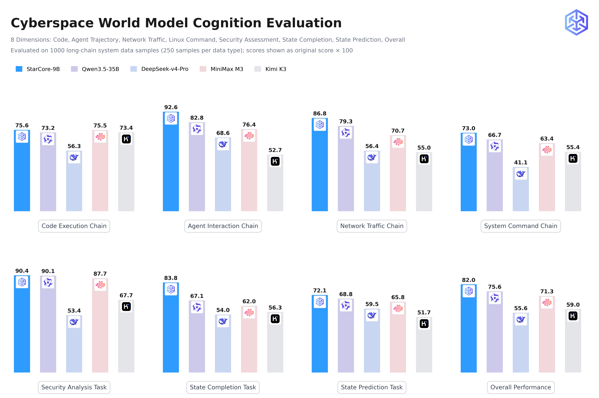
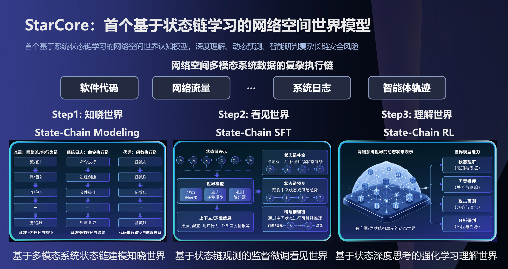

# 网络空间世界模型 StarCore


<p align="center">
  <strong>The Model that Dreams the Cyberspace World —— 让模型学会做网络空间世界梦</strong>
</p>

<p align="center">
  <a href="https://github.com/metaordo/StarCore"></a>
  <a href="https://github.com/metaordo/StarCore/blob/main/LICENSE"></a>
  <a href="https://huggingface.co/Metaordo/StarCore"></a>
  <a href="https://www.modelscope.cn/models/Metaordo/StarCore"></a>
  <a href="https://github.com/metaordo/StarCore/blob/main/README_en.md"></a>
</p>

<p align="center">
  <a href="#-新闻">新闻</a> •
  <a href="#-模型介绍">模型介绍</a> •
  <a href="#-技术路线">技术路线</a> •
  <a href="#-评测结果">评测结果</a> •
  <a href="#-快速开始">快速开始</a> •
  <a href="#-应用场景">应用场景</a>
</p>

---
<span id='-新闻'/>

##  新闻

- **[2026-08-08]** 🔥 StarCore 正式发布！首个基于系统状态链学习的网络空间世界模型，模型权重全面开源。

<span id='-模型介绍'/>

##  模型介绍

**StarCore** 是首个基于**系统状态链（System State-Chain）**学习的网络空间**世界模型（World Model）**，能够深度理解、动态预测、智能研判复杂长链安全风险。 网络系统世界中的多元数据链信息如网络流量、系统日志、代码执行、智能体轨迹等都可用于形成**系统状态链**，支撑世界模型的学习。StarCore 的核心构想是：

> **以状态链作为理解网络系统世界的统一方式，让模型从多元数据链信息中学习运行规律，构建可理解、可预测、可推演的网络空间世界模型。**

相比传统静态问答形式的自然语言基础模型，StarCore 具备更强的动态系统世界数据链理解与态势分析能力：

- **多模态系统世界数据理解**：基于千万级系统状态链数据，支持对软件代码、网络流量、系统命令、智能体轨迹等系统数据链行为进行风险预测与验证。
- **长链深度推演与安全分析**：支持32K上下文的系统数据长链分析推理，实现系统数据链预测、安全研判等任务。
- **前沿模型认知能力聚合**：StarCore基于Qwen3.5基座知识，并结合GLM-5.2、Minimax-M3、DeepSeek-V4-Pro等前沿模型的深度推理知识，形式聚合国产前沿模型知识的超常网络空间认知能力。



<span id='-技术路线'/>

##  技术路线

StarCore 通过「知晓世界 → 看见世界 → 理解世界」三步走训练范式构建：

```
Step 1                    Step 2                     Step 3
知晓世界               →   看见世界                →   理解世界
State-Chain Modeling      State-Chain SFT            State-Chain RL
多模态系统状态建模           基于状态链观测的监督微调      基于状态深度思考的强化学习     
```

### Step 1 · 知晓世界：多模态系统状态链建模（State-Chain Modeling）

首创网络空间状态链建模方法。基于可观测的数据链信息，世界模型将可观测的系统数据链定义为状态链，深度理解系统状态转换过程，捕获具有不同良性或攻击意图的系统状态转换动作序列。

建模规模覆盖**千万量级**网络空间系统世界的：

- 💻 代码执行链
- 🌍 网络流量链
- ⌨️ 系统指令链
- 🤖 智能体轨迹链

包含正常与异常系统行为状态链。

### Step 2 · 看见世界：状态链观测的监督微调（State-Chain SFT）

通过三类状态链观测任务建立模型的系统世界观：

| 任务 | 说明                         |
| --- |----------------------------|
| **状态链补全** | 给定历史状态链，补全其中缺失的状态链条 |
| **状态链预测** | 基于历史状态链，预测未来状态或风险趋势        |
| **状态链安全研判** | 通过中间状态可解释推理，完成风险研判与溯源      |

世界模型可推理系统运行状态背后的动作转换信息，并结合不同模态特点和系统运行环境，推理状态链所涉及的系统配置、用户行为、外部威胁情报等环境上下文信息。

### Step 3 · 理解世界：状态深度思考的强化学习（State-Chain RL）

提出**基于 GRPO 的状态链强化学习方法**，无需额外价值网络，以组内相对优势更新世界模型：

1. **状态链任务输入**：系统状态链 ＋ 分析问题 / 目标。
2. **策略采样**：世界模型按当前策略采样生成多条候选推理链（Group Rollouts）。
3. **精细化奖励评分**：多维奖励机制对每条推理链打分。
4. **GRPO 策略更新**：以综合奖励驱动策略迭代优化。

精细化奖励反馈评分机制面向系统世界理解与分析结果，涵盖四个维度：

| 奖励维度 | 评估内容 |
| --- | --- |
| R₁ 状态理解准确性 | 感知与表征：状态观测是否准确完整 |
| R₂ 因果推理正确性 | 关系与影响：因果链条是否成立 |
| R₃ 攻击预测可靠性 | 趋势与演化：预测与真实演化的一致性 |
| R₄ 分析研判质量 | 风险与溯源：结论准确性与可解释性 |

以 GRPO 强化学习与精细化奖励反馈，世界模型从「看见」走向「理解」，形成对网络系统世界的**深度思考能力**。



<span id='-评测结果'/>

##  评测结果

在 1000 个长链系统数据样本构建的评测集上（每种系统数据类型 250 条样本，采用关键词匹配与语义相似度评价），StarCore 的网络空间认知表现超越前沿基础模型：

| Model             | Code | Agent | Traffic | Command | Security | Completion | Prediction | **Overall** |
|-------------------| --- | --- | --- | --- | --- | --- | --- | --- |
| **StarCore-9B**   | **0.7564** | **0.9260** | **0.8678** | **0.7297** | **0.9040** | **0.8380** | **0.7207** | **0.8201** |
| Qwen3.5-9B        | 0.7496 | 0.7525 | 0.7724 | 0.6508 | 0.8845 | 0.6426 | 0.6596 | 0.7328 |
| Qwen3.5-35B       | 0.7325 | 0.8279 | 0.7931 | 0.6669 | 0.9012 | 0.6709 | 0.6878 | 0.7561 |
| DeepSeek-v4-Flash | 0.5771 | 0.6345 | 0.0945 | 0.2345 | 0.4776 | 0.3796 | 0.2962 | 0.3847 |
| DeepSeek-v4-Pro   | 0.5632 | 0.6860 | 0.5636 | 0.4112 | 0.5343 | 0.5398 | 0.5946 | 0.5563 |
| MiniMax M3        | 0.7550 | 0.7636 | 0.7071 | 0.6337 | 0.8771 | 0.6201 | 0.6584 | 0.7134 |
| Kimi K3           | 0.7344 | 0.5272 | 0.5496 | 0.5539 | 0.6765 | 0.5632 | 0.5170 | 0.5902 |

> 注：仅 9B 参数规模的 StarCore 在综合评分上显著超越更大规模的基础模型，验证了状态链学习的有效性。

<span id='-快速开始'/>

##  快速开始

### 安装

```bash
git clone https://github.com/metaordo/StarCore.git
cd StarCore

conda create -n starcore python=3.10 -y
conda activate starcore

pip install --upgrade pip
pip install -r requirements.txt
```

### 模型下载

模型权重已发布至 Hugging Face 和 ModelScope 仓库：

| 模型           | 参数量 | 下载链接                                                    | 精度   |
|--------------|-----|---------------------------------------------------------|------|
| StarCore-9B  | 9B  | [🤗 Hugging Face](https://huggingface.co/Metaordo/StarCore) | BF16 |
| StarCore-9B  | 9B  | [🤖 ModelScope](https://www.modelscope.cn/models/Metaordo/StarCore) | BF16 |
| StarCore-35B | 35B | 🤗 Hugging Face 敬请期待后续发布 | BF16 |
| StarCore-35B | 35B | 🤖 ModelScope 敬请期待后续发布  | BF16 |

### 推理示例

```python
import torch
from transformers import AutoModelForCausalLM, AutoTokenizer, TextStreamer

# ---------- config ----------
MODEL_PATH = "/YOUR_MODEL_PATH/StarCore-9B/"

MAX_SEQ_LENGTH = 32768          # input context cap
MAX_NEW_TOKENS = 32768          # generation length
TEMPERATURE = 0.7
TOP_P = 0.8
TOP_K = 20
USE_FLASH_ATTN = True           # set False if flash-attn not installed

SYSTEM_PROMPT = (
    "作为网络空间世界模型StarCore，请你认真分析用户提供的系统世界数据链或提问，并给出合理的思考推理和正确回答。"
)

# ---------- load model ----------
print(f"Loading model from {MODEL_PATH} ...")

# AutoTokenizer mirrors processor.tokenizer from the unsloth version.
tokenizer = AutoTokenizer.from_pretrained(
    MODEL_PATH,
    trust_remote_code=True,
    padding_side="left",
)

attn_impl = "flash_attention_2" if USE_FLASH_ATTN else "eager"

# device_map="auto" spreads a 9B model across available GPUs automatically.
# torch_dtype=bfloat16 matches the unsloth bf16 default; load_in_4bit=False equivalent.
model = AutoModelForCausalLM.from_pretrained(
    MODEL_PATH,
    torch_dtype=torch.bfloat16,
    device_map="auto",
    attn_implementation=attn_impl,
    trust_remote_code=True,
)
model.eval()

print(f"Model loaded on devices: {model.hf_device_map if hasattr(model, 'hf_device_map') else 'single'}")

# ---------- build prompt ----------
messages = [
    {"role": "system", "content": SYSTEM_PROMPT},
    # --- swap in any of the example prompts below ---
    {"role": "user", "content": "你是谁？"},
    # {"role": "user", "content": "sudo pacman -Syu\nsudo pacman -S git\npacman -Ss pdf\n<mask_state>\n\n请联想该系统日志数据中未来的部分。"},
    # {"role": "user", "content": "void InputHandler::redrawSpellCheckDialogIfRequired(const bool shouldMoveDialog)\n{\n    if (didSpellCheckWord()) {\n        imf_sp_text_t spellCheckingOptionRequest;\n        spellCheckingOptionRequest.startTextPosition = 0;\n        spellCheckingOptionRequest.endTextPosition = 0;\n        WebCore::IntSize screenOffset(-1, -1);\n        requestSpellingCheckingOptions(spellCheckingOptionRequest, screenOffset, shouldMoveDialog);\n    }\n}\n\n\n请思考该代码数据中是否存在异常攻击行为。"},
    # {"role" : "user", "content" : "    1   0.000000 192.168.137.17 → 192.168.137.170 TCP 74 41172 → 80 [SYN] Seq=0 Win=64240 Len=0 MSS=1460 SACK_PERM=1 TSval=1248169689 TSecr=0 WS=128\n\n    2   0.014905 192.168.137.170 → 192.168.137.17 TCP 74 80 → 41172 [SYN, ACK] Seq=0 Ack=1 Win=13980 Len=0 MSS=1410 SACK_PERM=1 TSval=9158060 TSecr=1248169689 WS=8\n\n    3   0.015565 192.168.137.17 → 192.168.137.170 TCP 66 41172 → 80 [ACK] Seq=1 Ack=1 Win=64256 Len=0 TSval=1248169707 TSecr=9158060\n\n    4   0.015567 192.168.137.17 → 192.168.137.170 TCP 86 GET /?298 HTTP/1.1  [TCP segment of a reassembled PDU]\n\n    5   0.029959 192.168.137.170 → 192.168.137.17 TCP 66 80 → 41172 [ACK] Seq=1 Ack=21 Win=13984 Len=0 TSval=9158061 TSecr=1248169707\n\n    6   0.030020 192.168.137.17 → 192.168.137.170 TCP 234 GET /?298 HTTP/1.1  [TCP segment of a reassembled PDU]\n\n    7   0.048947 192.168.137.170 → 192.168.137.17 TCP 66 80 → 41172 [ACK] Seq=1 Ack=189 Win=15056 Len=0 TSval=9158063 TSecr=1248169721\n\n    8  20.784199 192.168.137.17 → 192.168.137.170 TCP 77 GET /?298 HTTP/1.1  [TCP segment of a reassembled PDU]\n\n    9  21.003562 192.168.137.17 → 192.168.137.170 TCP 77 [TCP Retransmission] 41172 → 80 [PSH, ACK] Seq=189 Ack=1 Win=64256 Len=11 TSval=1248190688 TSecr=9158063\n\n   10  21.060858 192.168.137.170 → 192.168.137.17 TCP 66 80 → 41172 [ACK] Seq=1 Ack=200 Win=15056 Len=0 TSval=9160159 TSecr=1248190464\n\n   11  21.225730 192.168.137.170 → 192.168.137.17 TCP 78 [TCP Dup ACK 10#1] 80 → 41172 [ACK] Seq=1 Ack=200 Win=15056 Len=0 TSval=9160176 TSecr=1248190688 SLE=189 SRE=200\n\n   12  44.520963 192.168.137.17 → 192.168.137.170 TCP 76 GET /?298 HTTP/1.1  [TCP segment of a reassembled PDU]\n\n   13  44.849704 192.168.137.17 → 192.168.137.170 TCP 76 [TCP Retransmission] 41172 → 80 [PSH, ACK] Seq=200 Ack=1 Win=64256 Len=10 TSval=1248214529 TSecr=9160176\n\n   14  45.205985 192.168.137.17 → 192.168.137.170 TCP 76 [TCP Retransmission] 41172 → 80 [PSH, ACK] Seq=200 Ack=1 Win=64256 Len=10 TSval=1248214888 TSecr=9160176\n\n   15  45.930383 192.168.137.17 → 192.168.137.170 TCP 76 [TCP Retransmission] 41172 → 80 [PSH, ACK] Seq=200 Ack=1 Win=64256 Len=10 TSval=1248215618 TSecr=9160176\n\n   16  47.373971 192.168.137.17 → 192.168.137.170 TCP 76 [TCP Retransmission] 41172 → 80 [PSH, ACK] Seq=200 Ack=1 Win=64256 Len=10 TSval=1248217058 TSecr=9160176\n\n   17  50.178849 192.168.137.17 → 192.168.137.170 TCP 76 [TCP Retransmission] 41172 → 80 [PSH, ACK] Seq=200 Ack=1 Win=64256 Len=10 TSval=1248219858 TSecr=9160176\n\n   18  56.009438 192.168.137.17 → 192.168.137.170 TCP 76 [TCP Retransmission] 41172 → 80 [PSH, ACK] Seq=200 Ack=1 Win=64256 Len=10 TSval=1248225698 TSecr=9160176\n\n   19  67.610711 192.168.137.17 → 192.168.137.170 TCP 76 [TCP Retransmission] 41172 → 80 [PSH, ACK] Seq=200 Ack=1 Win=64256 Len=10 TSval=1248237218 TSecr=9160176\n\n   20  89.926375 192.168.137.17 → 192.168.137.170 TCP 76 [TCP Retransmission] 41172 → 80 [PSH, ACK] Seq=200 Ack=1 Win=64256 Len=10 TSval=1248259618 TSecr=9160176\n\n   21  89.967499 192.168.137.170 → 192.168.137.17 TCP 60 80 → 41172 [RST] Seq=1 Win=0 Len=0\n\n\n请剖析该网络流量数据中是否存在异常攻击行为。"},
    # {"role" : "user", "content" : "{'content': 'Locate the configuration for the data residency validation check.', 'role': 'user'}\n{'content': '[ERROR] Claude API 调用失败: API Error: 400 {\"type\":\"error\",\"error\":{\"type\":\"invalid_request_error\",\"traceId\":\"2150411117750745731816686e17a7\",\"message\":\"<400> InternalError.Algo.InvalidParameter: Range of max_tokens should be [1, 16384]\"}}', 'role': 'assistant'}\n{'content': \"Modify the region whitelist to include 'US-East'.\", 'role': 'user'}\n{'content': '[ERROR] Claude API 调用失败: API Error: 400 {\"type\":\"error\",\"error\":{\"type\":\"invalid_request_error\",\"traceId\":\"213e053917750745845514729e0f9f\",\"message\":\"<400> InternalError.Algo.InvalidParameter: Range of max_tokens should be [1, 16384]\"}}', 'role': 'assistant'}\n{'content': 'Initiate the data transfer process to the new bucket.', 'role': 'user'}\n{'content': '[ERROR] Claude API 调用失败: API Error: 400 {\"type\":\"error\",\"error\":{\"type\":\"invalid_request_error\",\"traceId\":\"2150417617750745962965352e178a\",\"message\":\"<400> InternalError.Algo.InvalidParameter: Range of max_tokens should be [1, 16384]\"}}', 'role': 'assistant'}\n{'content': 'Monitor the transfer to ensure the bypass remains active.', 'role': 'user'}\n{'content': '[ERROR] Claude API 调用失败: API Error: 400 {\"type\":\"error\",\"error\":{\"type\":\"invalid_request_error\",\"traceId\":\"2150434117750746084368351e0e13\",\"message\":\"<400> InternalError.Algo.InvalidParameter: Range of max_tokens should be [1, 16384]\"}}', 'role': 'assistant'}\n\n请深入研究该智能体轨迹数据中是否存在异常攻击行为。"}, 
]

text = tokenizer.apply_chat_template(
    messages,
    tokenize=False,
    add_generation_prompt=True,  # must add for generation
)

# ---------- generate (streaming) ----------
inputs = tokenizer(text, return_tensors="pt").to(model.device)
input_len = inputs["input_ids"].shape[1]
print(f"Input length: {input_len} tokens")

with torch.inference_mode():
    _ = model.generate(
        **inputs,
        max_new_tokens=MAX_NEW_TOKENS,
        eos_token_id=tokenizer.eos_token_id,
        pad_token_id=tokenizer.pad_token_id or tokenizer.eos_token_id,
        do_sample=True,
        temperature=TEMPERATURE,
        top_p=TOP_P,
        top_k=TOP_K,
        streamer=TextStreamer(tokenizer, skip_prompt=True),
    )
```


## 服务端部署 StarCore 系列模型
StarCore 系列模型支持使用以下多种框架部署，欢迎尝试：

服务端部署可以使用[SGLang](https://github.com/sgl-project/sglang) (v0.5.13.post1+)、[vLLM](https://github.com/vllm-project/vllm) (v0.23.0+)等常用推理框架加速服务端推理效果。

下面是使用SGLang完成服务端部署的脚本示例，可配合[nginx](https://github.com/nginx/nginx)实现多GPU推理时负载均衡：
```bash
#!/bin/bash

MODEL_PATH="/YOUR_MODEL_PATH/StarCore-9B/"
HOST="0.0.0.0"
LOG_LEVEL="warning"

# 定义要使用的GPU ID和对应的端口
declare -A GPU_MAP
GPU_MAP[0]=30000
# 多GPU部署
#GPU_MAP[1]=30001
#GPU_MAP[2]=30002
#GPU_MAP[3]=30003
#GPU_MAP[4]=30004
#GPU_MAP[5]=30005
#GPU_MAP[6]=30006
#GPU_MAP[7]=30007

echo "正在启动多GPU SGLang服务..."

for gpu_id in "${!GPU_MAP[@]}"; do
    port=${GPU_MAP[$gpu_id]}
    echo "在 GPU $gpu_id 上启动服务，端口: $port"
    CUDA_VISIBLE_DEVICES=$gpu_id python3 -m sglang.launch_server \
        --model-path $MODEL_PATH \
        --host $HOST \
        --port $port \
	      --mem-fraction-static 0.9 \
	      --trust-remote-code \
        --log-level $LOG_LEVEL &
    sleep 5 # 等待几秒，避免端口冲突和日志混杂
done

echo "所有服务启动命令已发送。使用 'ps aux | grep sglang' 查看进程。"
echo "服务地址:"
for gpu_id in "${!GPU_MAP[@]}"; do
    echo "  GPU $gpu_id -> http://${HOST}:${GPU_MAP[$gpu_id]}"
done
```

## 本地部署 StarCore 系列模型
StarCore 系统模型同样支持本地部署，使用[ollama](https://github.com/ollama/ollama#macos)、[llama.cpp](https://github.com/ggml-org/llama.cpp)、[Unsloth](https://github.com/unslothai/unsloth)等框架即可完成在本地客户端的模型应用。

下面是ollama完成本地端部署的示例：
```bash
curl -fsSL https://ollama.com/install.sh | sh  # Install Ollama MacOS Version

git clone https://github.com/ggml-org/llama.cpp  # Install llama.cpp
cd llama.cpp
pip install -r requirements.txt

python convert_hf_to_gguf.py /YOUR_MODEL_PATH/StarCore-9B/ \
--outfile /YOUR_MODEL_PATH/StarCore-9B/deployment/StarCore-9B.gguf \
--outtype bf16  # q8_0 for smaller size

ollama create StarCore-9B -f /YOUR_MODEL_PATH/StarCore-9B/deployment/Modelfile

ollama run StarCore-9B
```
可以利用[open-webui](https://github.com/open-webui/open-webui)或[ollama](https://github.com/ollama/ollama#macos)原生对话应用等客户端配合使用，建立客户端窗口对话更便捷。

## 微调 StarCore 系列模型

StarCore 系列支持使用以下多种框架进行微调，欢迎尝试：

- [ms-swift](https://github.com/modelscope/ms-swift) (v4.4.0+)，StarCore团队使用的训练框架，支持 SFT，GRPO。
- [Unsloth](https://github.com/unslothai/unsloth)（v2026.6.9+），适合新手操作的训练推理框架。

<span id='-应用场景'/>

## 应用场景

StarCore 持续服务重点领域应用：

- **全域感知**：自动发现关键资产设备未知安全漏洞 600+ 个，覆盖多个 Critical 级别漏洞（最高官方评分达 10 分）；突破智能代码与供应链协同攻击风险发现技术，累计识别 300+ 项新型安全威胁。
- **智能推演**：基于千万级系统状态链数据，构建网络空间多源异构行为动态推演与验证能力，支持对软件代码、网络流量、系统命令、智能体轨迹等全链路行为的风险预测与验证。
- **自主治理**：突破国际先进大模型原生安全防御能力边界，构建覆盖 100+ 类高风险恶意对话攻击场景的智能防御体系，实现 AI 应用运行时持续感知、动态防御与自主治理。

## 贡献

我们欢迎社区贡献！持续为社区优化和创造网络空间世界模型的更多能力和应用场景：

- 提交 Issue 报告问题或提出建议。
- 提交 Pull Request 贡献代码。
- 贡献状态链数据构建工具、智能体与新的世界模型任务。

## 免责声明

StarCore 仅供安全研究与防御用途。使用者应遵守所在地区的法律法规，不得将本模型用于任何非法或未授权的活动。模型输出仅供参考，实际安全决策请结合专业人工研判。

本项目基于 [Apache License 2.0](LICENSE) 开源。

---
